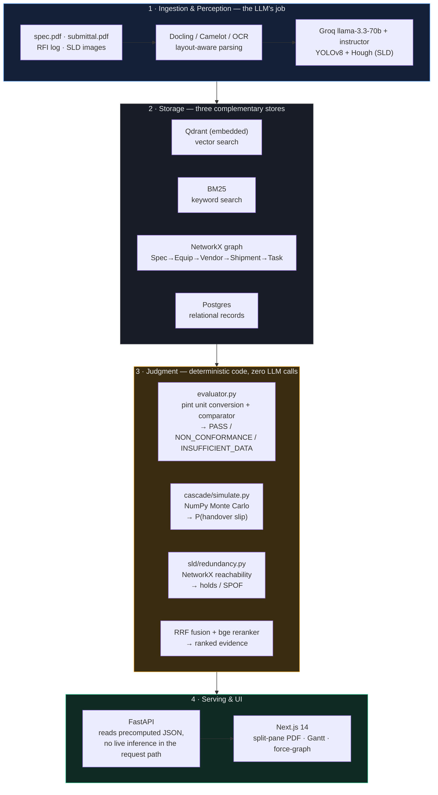

# Architecture — PS4 Data Centre EPC Project Intelligence

## The rule everything else follows

> **The LLM perceives. Deterministic code judges.**

An LLM reads a spec clause or a vendor cut-sheet and produces a typed
record — a value, a unit, a condition. It never decides whether that value
is compliant. A separate, plain-Python function does the comparison and
emits exactly one of three outcomes: `PASS`, `NON_CONFORMANCE`, or
`INSUFFICIENT_DATA`. The third outcome is mandatory — if the submittal
doesn't state the ambient temperature a constraint is conditioned on, we
say so, and we never guess.

**Why this is non-negotiable, not a style preference:** an LLM asked
"is this compliant?" will confidently answer even when it's wrong — it has
no mechanism to know it doesn't know. A verifier that hallucinates a PASS
is worse than no verifier, because it's trusted. `480 kW` and `480 kVA`
render identically as text and differ by a power factor an LLM will
silently ignore; `pint`-based unit conversion in plain code will not. This
project's one rule to never break: if you ever write
`llm.ask("is this compliant?")`, stop — you're building the failure mode
the whole system exists to prevent.

The benchmark proves the payoff, not just the architecture diagram: on the
50-question ground truth, the deterministic evaluator scores **1.00
precision / 1.00 recall** on deviation detection; a naive RAG chatbot that
lets an LLM judge scores **0.42 / 0.45** — and critically, it almost never
says `INSUFFICIENT_DATA`, because a chatbot asked a question wants to sound
confident. See `data/benchmark/results/results_table.md`.

---

## Four layers

The amber layer (Judgment) is the load-bearing one. Every arrow crossing
into it carries a typed Pydantic object, never raw text — the judge never
sees a prompt, only structured input it compares against structured
requirements.

---

## Layer 1 — Ingestion & Perception

| Component | Tool | Job |
|---|---|---|
| PDF parsing | `docling` | Layout-aware — a merged table cell stays a table cell, unlike `pypdf` which shreds it into unstructured text |
| Table extraction | `camelot` | Vendor cut-sheet tables specifically |
| OCR fallback | RapidOCR (via docling) | Scanned/image-only pages |
| Requirement extraction | Groq `llama-3.3-70b-versatile` + `instructor` | Spec clause → `Requirement` (value, unit, operator, **condition**) |
| Value extraction | same, second prompt | Submittal text → `ExtractedValue` |
| SLD symbol/wire detection | YOLOv8 + OpenCV Hough transform | Diagram → `SLDNode[]` / `SLDEdge[]` (computer vision, not an LLM, but still "perception" — it doesn't judge redundancy) |

**Provenance is structural, not requested.** `source_page` and
`source_bbox` are attached from the input chunk *after* the LLM call
returns — never asked of the model, never able to be hallucinated. This is
what lets the frontend draw the red box on the exact clause; without it,
there's no demo, just a claim.

**A real bug this discipline caught (Session 8):** the first time the
ingestion pipeline was actually run end-to-end against the fixture PDFs —
after seven sessions of only unit-testing the evaluator against synthetic
`Requirement` objects — the extractor invented two entirely fictional
requirements ("pump water pressure == 10 bar") from a chunk that was just
a section title with no numbers in it at all. The fix was a six-line
prompt addition ("if the chunk contains no explicit numeric constraint,
return an empty list"), not an architecture change — but it's a concrete
reminder that "the LLM perceives" still means the LLM can be wrong, which
is exactly why layer 3 never trusts layer 1's output without a second,
independent extraction to compare against.

## Layer 2 — Storage

Three stores, each answering a question the others can't:

- **Qdrant** (embedded/local, `data/qdrant_local/`) — semantic similarity.
  Cannot distinguish `TX-01` from `TX-10` (near-identical embeddings, very
  different equipment).
- **BM25** (`rank_bm25`, in-memory) — exact keyword/identifier match. Can't
  tell "chiller" and "cooling unit" are the same thing.
  Fused with Reciprocal Rank Fusion, then reranked with a bge cross-encoder,
  so retrieval gets both keyword precision and semantic recall.
- **NetworkX graph** — `Spec --REQUIRES--> Equipment --SUBMITTED_BY-->
  Vendor --DELIVERS--> Shipment --BLOCKS--> Task`, with Task being the real
  111-task cascade schedule. Every edge comes from data already extracted
  elsewhere in the pipeline — nothing is invented for the graph. Shaped
  like a Neo4j schema (and `graph/neo4j_sync.py` can push it to a live
  AuraDB instance) but runs on NetworkX + a precomputed `data/graph.json`
  here, since no live Neo4j credentials exist in this environment and a
  demo should never depend on a service being reachable.
- **Postgres** — relational records for the production deployment story;
  not on the live demo's critical path (see "What's real vs. aspirational"
  below).

## Layer 3 — Judgment

This is the only layer that renders a verdict, and it never calls an LLM:

- `evaluator.py` — `pint`-based unit conversion (the kVA/kW power-factor
  trap lives here) + operator comparison → `PASS` / `NON_CONFORMANCE` /
  `INSUFFICIENT_DATA`.
- `cascade/simulate.py` — vectorized NumPy Monte Carlo over the real
  111-task DAG → handover-day distribution, `P(slip)`.
- `sld/redundancy.py` — NetworkX `all_simple_paths` + set intersection →
  does 2N actually hold, or is there a shared node (SPOF)?
- RRF fusion + reranking — deterministic given its inputs; ranking is not
  a judgment call the way a compliance verdict is, but it's still not an
  LLM decision.

## Layer 4 — Serving & UI

FastAPI endpoints read precomputed JSON (`data/*.json`) or run cheap local
computation (graph traversal, Monte Carlo — milliseconds, not API calls).
**No live inference happens in the request path** except one endpoint:
`POST /api/query`, where an LLM classifies the question into
`factual | compliance_check | topological | schedule` and dispatches to
the matching engine above — the classification is the only network call
anywhere in the serving layer, and even that has a precomputed cache for
the fixed demo question set (`data/demo_query_cache.json`) so the demo
itself never depends on it being reachable. See
`retrieval/router.py`'s module docstring.

---

## Offline / demo mode

Every artifact under `data/*.json` (plus `data/qdrant_local/`, the
embedded vector store) is precomputed and committed to git — a fresh
checkout already has everything the demo needs. `make demo` /
`python scripts/seed_demo.py` starts the two services and waits for them
to answer; it does not recompute anything, because recomputing would
reintroduce a network dependency.

`scripts/verify_offline.py` is the rigorous version of "turn off wifi and
try it": it unsets `GROQ_API_KEY` and forces `HF_HUB_OFFLINE=1` /
`TRANSFORMERS_OFFLINE=1` in-process, then runs the exact sequence of calls
`docs/DEMO_SCRIPT.md` uses. If any of them secretly needed the network,
this fails loudly with a real exception instead of silently passing
because the test machine happened to have wifi. All 14 steps in the demo
sequence pass with zero network access.

---

## What's real vs. aspirational in this repo

Stated plainly, because a scalability slide that quietly assumes services
nobody has ever started is worse than one that's honest about it:

- **Real, running, tested:** the four judgment engines (evaluator, cascade
  simulator, SLD redundancy analyser, hybrid retrieval), the NetworkX
  graph, the embedded Qdrant store, the FastAPI + Next.js app, the
  benchmark harness.
- **Represents the target deployment, not exercised by the demo:**
  `docker-compose.yml`'s `postgres` and `qdrant` *service* containers.
  Nothing in the live code path currently writes to Postgres, and the app
  talks to an embedded local Qdrant, not the containerized one — those
  services exist in the compose file to show the intended production
  topology (and Neo4j sync is one `neo4j_sync.py` script away from real
  once AuraDB credentials exist), not because the demo needs them running.

## Known limitations (disclosed, not hidden)

- **SLD wire detection:** 3 of the 5 demo topologies currently return zero
  detected source-to-load paths (a Hough-transform connectivity gap, not a
  redundancy miss) — the demo script deliberately uses `sld-03`/`sld-04`,
  the two that work. Flagged in Session 6, not fixed during Session 8's
  feature freeze.
- **Condition-text matching:** the evaluator requires a submittal's
  condition text to match the spec's condition text after normalizing
  case and whitespace — it does not do fuzzy/synonym matching (e.g. "35C
  ambient" vs. "35C ambient dry-bulb" are treated as different
  conditions). This is intentionally conservative — the alternative is
  guessing two conditions are the same when they might not be — but it
  means two independently-worded extractions of the same real-world
  condition can produce a false `INSUFFICIENT_DATA` rather than a match.
- **Ctrl+F baseline numbers** in the benchmark table are a modeled
  estimate (see `data/benchmark/ctrl_f_baseline.json`), not an empirical
  timed trial.
- **RFI contradiction detection** is precision-tuned conservatively (2
  contradictions currently flagged from 21 historical RFIs, both verified
  correct) — the LLM-perceives/code-judges split here uses a
  `has_unstated_caveat` signal that trades recall for precision on
  purpose, per `rfi/dedup.py`.
